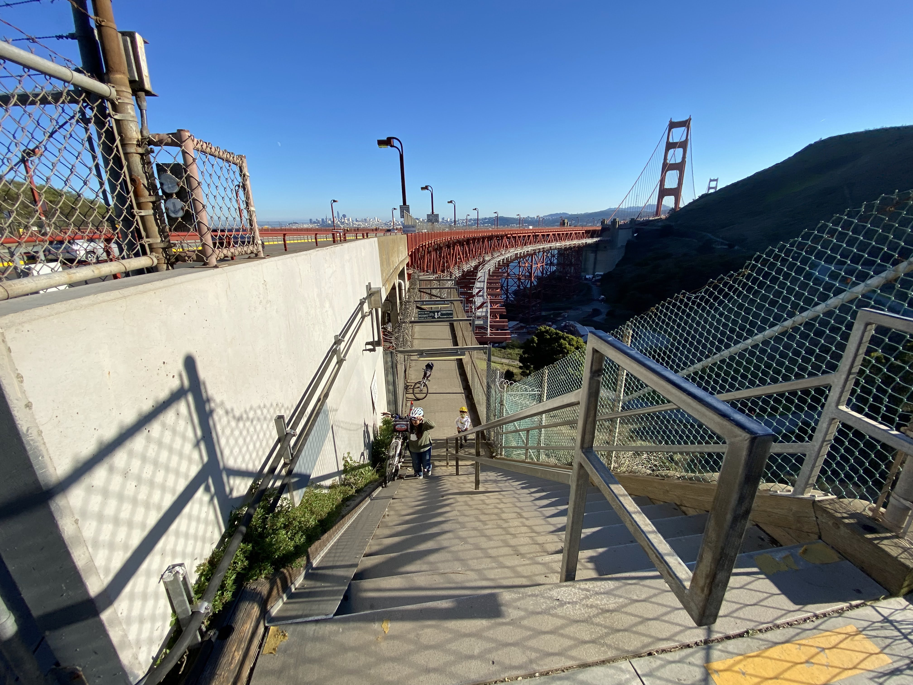
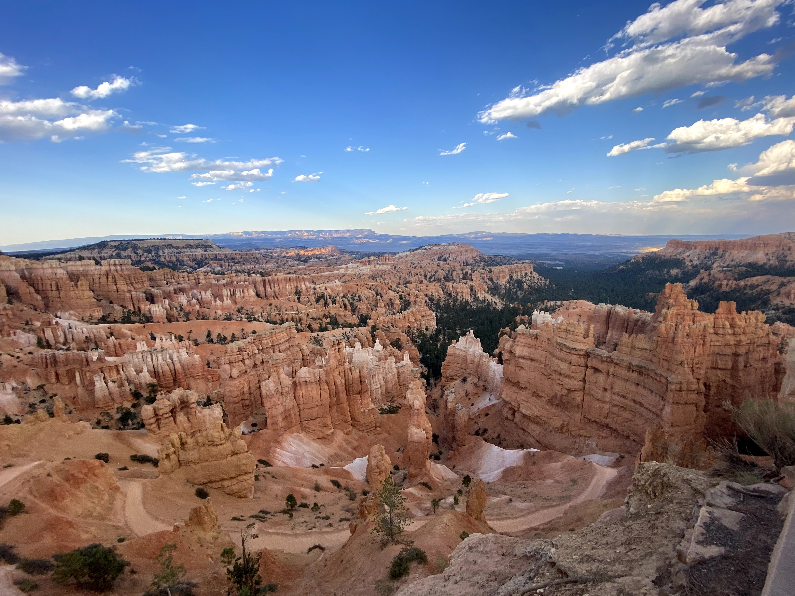
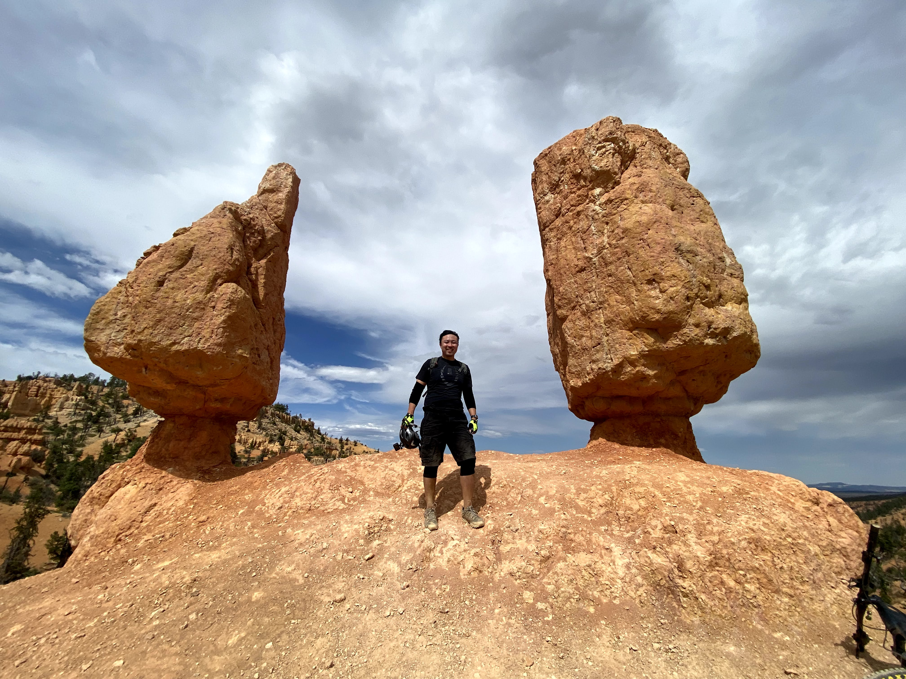

```{r setup, include=FALSE}
knitr::opts_chunk$set(echo = FALSE)
```


## Silverwood Lake
```{r}
knitr::include_graphics("img/IMG_5823.jpg")
```

<br>

## New Year's Day
Riding a bike through this hard packed snow was an experience  

```{r}
knitr::include_graphics("img/IMG_5382.jpg")
```

<br>

## Golden Gate Bridge
E-bikes are heavy as $hit  

```{r}

```

<br>

## Baker, 2021
I enjoy the drive to Vegas almost as much as being in Vegas  

```{r}
knitr::include_graphics("img/IMG_1485.jpg")
```

<br>

## Bryce Canyon
```{r}


```
